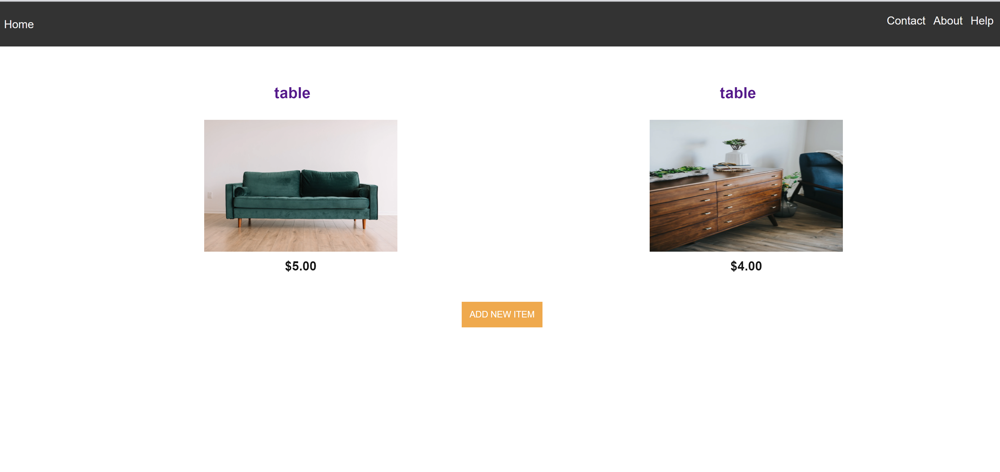

# Housewill

This application is made for users who want to sell their gently used household item and want to make a listing for the community to keep an eye out. Users are able to create and post item. They can view other listings items and for others to see. 

## How to get started?

Simple! You start by searching item of your choice and by find item by category. It's not complicated at all. You can then go to the item page and find items and contact seller or make your own listing by adding new item by clicking "ADD NEW ITEM". This site was made for all people of all ages.

# Features

- Create a new posting
- Search item from existing item
- Delete any item
- Communicate seller for for details information
- Preview the item
- Save the Item 

## Technology

- Front-End: HTML5, CSS3, JavaScript ES6, React
- Back-End: Node.js, Express.js, Mocha, Chai, RESTful API Endpoints, Postgres
- Production Environment: Heroku, Vercel

## Working Prototype

You can access a working prototype of the:

  React(Client) app here:  
    https://housewill-client.vercel.app/  
    
  Node/Express(Server) API here:  
    https://github.com/SultanaK/Housewill-Api 

## User Stories

This app is for types of users: a REGISTERED USER and an UNREGISTERED USER

## Screenshots

Landing Page
:-------------------------:

Category page
:-------------------------:

Search Page
:-------------------------:

Item Page  
:-------------------------:

Add new Item
:-------------------------:

API Documentation:

Link: https://github.com/SultanaK/Housewill-Api

POST Features: - '/add-item' is made for users to add new item - 

GET Features: - '/items/:item_id' accesses the specific logged in users profile - '/items' displays all the items - '/pups/:id' shows a personal page of the specific item - '/items/:item_id ^^^

DELETE Feauture: - '/items/:item_id' deletes a certain pup listing

## Responsive

App is built to be usable on mobile devices, as well as responsive across mobile, tablet, laptop, and desktop screen resolutions.

## Development Roadmap

This is v1.0 of the app, but future enhancements are expected to include:

-  enable users to view and create post
-  a marketplace to see other posting

## How to run it

Use command line to navigate into the project folder and run the following in terminal

### Local Server/Node scripts

- clone repo https://github.com/SultanaK/Housewill-Api
- To install the node project ===> npm install
- To migrate the database ===> npm run migrate -- 1
- To run Node server (on port 8000) ===> npm run dev
- To run tests ===> npm run test

### Local Client/React scripts

- clone repo https://github.com/SultanaK/Housefull-client
- To install the react project ===> npm install
- To run react (on port 3000) ===> npm start
- To run tests ===> npm run test
